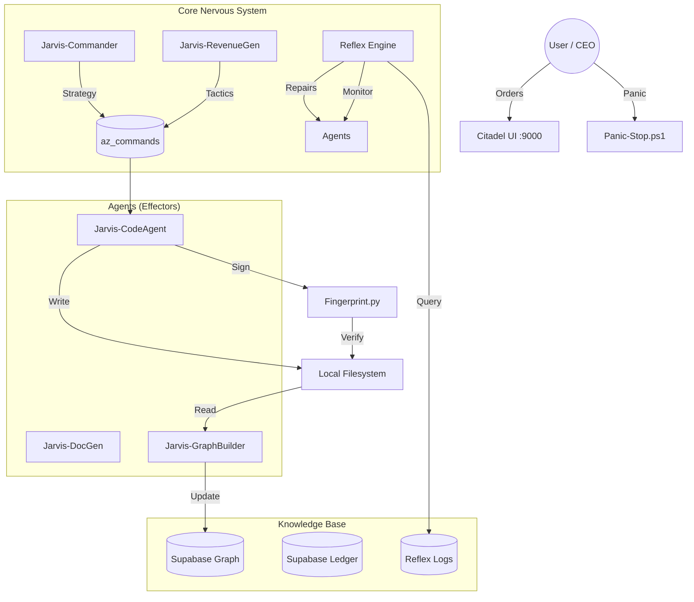

# AION-ZERO System Architecture

## Overview
AION-ZERO is an **Autonomous Enterprise Organism** designed to operate as a fractional C-Suite and Engineering Team. It integrates eight pillars of intelligence to perceive, reason, and act within a Windows Server environment.

## Architecture Diagram

## Component Dictionary

### 1. The Commander (`Jarvis-Commander.ps1`)
*   **Role**: Chief Operating Officer (COO).
*   **Function**: Runs weekly. Analyzes budget, stability, and growth. Issues high-level strategic commands.

### 2. The Revenue Generator (`Jarvis-RevenueGenerator.ps1`)
*   **Role**: Product Owner / Sales.
*   **Function**: Runs hourly. Scans business data (ReachX) to generate revenue-generating tasks (reports, optimizations).

### 3. The Code Agent (`Jarvis-CodeAgent.ps1`)
*   **Role**: Senior Engineer.
*   **Function**: Consumes commands. Writes code. Updates system state. Uses `fingerprint.py` to sign work.

### 4. The Reflex Engine (`Jarvis-ReflexEngine.ps1` + `reflex_engine.py`)
*   **Role**: Reliability Engineer / Immune System.
*   **Function**: Runs every 5 mins. Diagnoses failures. Restarts services. Patches code (L5 Autonomy).

### 5. The Citadel (`citadel/main.py`)
*   **Role**: Control Tower.
*   **Function**: Visualizes all system metrics (Health, Finance, Intelligence) on Port 9000.

### 6. The Graph (`graph_builder.py`)
*   **Role**: Long-term Memory.
*   **Function**: Ingests code and docs into a semantic graph for retrieval by agents.

## Data Flow
1.  **Perception**: GraphBuilder scans files -> GraphDB.
2.  **Reasoning**: Commander queries GraphDB -> Decides Strategy.
3.  **Action**: CodeAgent executes Strategy -> Modifies Files.
4.  **Verification**: Reflex monitors changes -> Fixes if broken.
